# ⚡ Automatic Stripe Payment Setup

**Date**: November 3, 2025  
**Status**: ✅ **FULLY AUTOMATIC** - No manual scripts needed!  
**Version**: 2.0.0

---

## 🎯 What Changed

### Before (Manual) ❌

```
User clicks "Add Payment Method"
  ↓
Show dialog: "Run script in terminal..."
  ↓
User manually runs script
  ↓
User comes back and retries
  ↓
Finally works
```

### Now (Automatic) ✅

```
User clicks "Add Payment Method"
  ↓
App automatically creates Stripe customer
  ↓
Shows card input form
  ↓
User adds card
  ↓
Done! ✨
```

---

## 🚀 Quick Setup (5 Minutes)

### Step 1: Install Dependencies

```bash
cd trippo_user/functions
npm install
```

**This installs:**
- `firebase-functions` - Cloud Functions runtime
- `firebase-admin` - Firebase Admin SDK
- `stripe` - Stripe Node.js SDK
- `cors` - CORS support for HTTP functions

### Step 2: Configure Stripe Secret Key

**Option A: Using Firebase CLI (Recommended)**

```bash
firebase functions:config:set stripe.secret_key="sk_test_YOUR_KEY_HERE"
```

**Option B: Using Environment Variable (Local Development)**

```bash
# In trippo_user/functions directory
echo "STRIPE_SECRET_KEY=sk_test_YOUR_KEY_HERE" > .env
```

**Get your key from**: [Stripe Dashboard → API Keys](https://dashboard.stripe.com/test/apikeys)

### Step 3: Deploy Cloud Functions

```bash
cd trippo_user
firebase deploy --only functions
```

**Expected output:**
```
✔  Deploy complete!

Functions:
  createStripeCustomer(us-central1): https://...
  attachPaymentMethod(us-central1): https://...
  detachPaymentMethod(us-central1): https://...
```

### Step 4: Test in App

```bash
flutter run
```

**Test flow:**
1. Login as passenger
2. Go to: Profile → Payment Methods
3. Click "Add Payment Method"
4. ✅ Should automatically create account
5. ✅ Add card: `4242 4242 4242 4242`
6. ✅ Success!

---

## 📦 What Was Created

### 1. Firebase Cloud Functions

**File**: `functions/index.js`

**Functions created:**

#### `createStripeCustomer`
- **Trigger**: HTTPS POST request from app
- **Purpose**: Creates Stripe customer when user adds first payment method
- **Security**: Uses secret key stored server-side
- **Response**: Returns Stripe customer ID

#### `attachPaymentMethod`
- **Trigger**: HTTPS POST request from app
- **Purpose**: Attaches payment method to customer
- **Security**: Validates customer ownership

#### `detachPaymentMethod`
- **Trigger**: HTTPS POST request from app
- **Purpose**: Removes payment method from customer
- **Security**: Validates customer ownership

### 2. Updated Repository

**File**: `lib/data/repositories/stripe_repository.dart`

**Changes:**
- ✅ Automatically calls Cloud Function to create customers
- ✅ Handles errors gracefully
- ✅ Provides helpful messages if functions not deployed
- ✅ No manual scripts needed

### 3. Updated UI

**File**: `lib/View/Screens/Main_Screens/Profile_Screen/Payment_Methods_Screen/payment_methods_screen.dart`

**Changes:**
- ✅ Automatically creates customer when needed
- ✅ Shows progress: "Creating payment account..."
- ✅ Success feedback: "✅ Payment account created!"
- ✅ Error handling with clear messages

---

## 🔒 Security Architecture

```
┌─────────────────────────────────────────┐
│           Mobile App (Flutter)          │
│                                         │
│  ✅ Publishable Key (pk_test_...)      │
│  ✅ Can collect card details           │
│  ❌ Cannot charge cards                │
│  ❌ Cannot create customers             │
└──────────────┬──────────────────────────┘
               │
               │ HTTPS POST
               │
               ▼
┌─────────────────────────────────────────┐
│      Cloud Function (Node.js)           │
│                                         │
│  ✅ Secret Key (sk_test_...)           │
│  ✅ Can create customers                │
│  ✅ Can charge cards (future)           │
│  ✅ Runs on Firebase servers            │
└──────────────┬──────────────────────────┘
               │
               │ Stripe API
               │
               ▼
┌─────────────────────────────────────────┐
│             Stripe API                  │
│                                         │
│  ✅ Creates customer                    │
│  ✅ Stores payment methods              │
│  ✅ Handles payments securely           │
└─────────────────────────────────────────┘
```

**Why this is secure:**
- 🔒 Secret key never leaves server
- 🔒 App can't create fraudulent charges
- 🔒 PCI compliance maintained
- 🔒 Stripe handles card data

---

## 🧪 Testing the Automatic Setup

### Test 1: First Time User

```bash
# 1. Register new account
# 2. Login
# 3. Go to Profile → Payment Methods
# 4. Click "Add Payment Method"

Expected:
✅ "Creating payment account..." (2 seconds)
✅ "✅ Payment account created successfully!"
✅ Card input form appears
✅ Add card and it works
```

### Test 2: Existing User (Has Customer)

```bash
# 1. Login with existing user
# 2. Go to Profile → Payment Methods
# 3. Click "Add Payment Method"

Expected:
✅ Card input form appears immediately
✅ No "Creating account" message
✅ Add card and it works
```

### Test 3: Error Handling (Functions Not Deployed)

```bash
# Don't deploy functions, just test the app

Expected:
❌ Error message shows setup instructions
❌ Explains how to deploy functions
❌ Provides fallback to script
```

---

## 🎓 How It Works

### User Flow

```mermaid
sequenceDiagram
    User->>App: Click "Add Payment Method"
    App->>Firestore: Check if customer exists
    
    alt Customer doesn't exist
        App->>User: Show "Creating account..."
        App->>Cloud Function: POST /createStripeCustomer
        Cloud Function->>Stripe: Create customer
        Stripe-->>Cloud Function: Customer ID
        Cloud Function->>Firestore: Save customer data
        Cloud Function-->>App: Success
        App->>User: "✅ Account created!"
    end
    
    App->>User: Show card input form
    User->>App: Enter card details
    App->>Stripe SDK: Create payment method
    Stripe SDK-->>App: Payment method token
    App->>Cloud Function: POST /attachPaymentMethod
    Cloud Function->>Stripe: Attach to customer
    Stripe-->>Cloud Function: Success
    Cloud Function->>Firestore: Update customer
    Cloud Function-->>App: Success
    App->>User: "✅ Card added!"
```



### Behind the Scenes

**1. Customer Creation**
```javascript
// In Cloud Function
const customer = await stripe.customers.create({
  email: user.email,
  name: user.name,
  metadata: { userId, app: 'BTrips' }
});

// Save to Firestore
await firestore.collection('stripeCustomers')
  .doc(userId)
  .set({ stripeCustomerId: customer.id, ... });
```

**2. Payment Method Collection**
```dart
// In Flutter app (using Stripe SDK)
final paymentMethod = await Stripe.instance.createPaymentMethod(
  params: PaymentMethodParams.card(...)
);
```

**3. Payment Method Attachment**
```javascript
// In Cloud Function
await stripe.paymentMethods.attach(paymentMethodId, {
  customer: stripeCustomerId
});
```

---

## 📊 Firebase Console Verification

### Check Functions Deployed

1. Open [Firebase Console](https://console.firebase.google.com)
2. Go to: Functions
3. Should see:
   - ✅ `createStripeCustomer` (Active)
   - ✅ `attachPaymentMethod` (Active)
   - ✅ `detachPaymentMethod` (Active)

### Check Firestore Data

1. Open [Firebase Console](https://console.firebase.google.com)
2. Go to: Firestore Database
3. Collection: `stripeCustomers`
4. Should see documents with:
   - `userId`: Firebase UID
   - `stripeCustomerId`: `cus_...`
   - `email`: User's email
   - `paymentMethods`: Array of cards

### Check Function Logs

```bash
firebase functions:log

# Should show:
# ✅ Created Stripe customer cus_ABC123 for user xyz789
# ✅ Attached payment method pm_123 to customer cus_ABC123
```

---

## 🐛 Troubleshooting

### Error: "Unable to connect to payment server"

**Cause**: Cloud Functions not deployed

**Solution**:
```bash
cd trippo_user
firebase deploy --only functions
```

### Error: "Stripe secret key not configured"

**Cause**: Secret key not set in Firebase config

**Solution**:
```bash
firebase functions:config:set stripe.secret_key="sk_test_..."
firebase deploy --only functions
```

### Error: "Customer created but not found in Firestore"

**Cause**: Firestore rules or permissions issue

**Solution**:
1. Check Firestore rules allow writing to `stripeCustomers`
2. Check Cloud Function has proper permissions
3. Check function logs: `firebase functions:log`

### Functions Deploy Fails

**Possible causes:**
- Not logged in to Firebase CLI
- Wrong project selected
- Billing not enabled (Functions require Blaze plan)

**Solutions**:
```bash
# Login
firebase login

# Select project
firebase use trippo-42089

# Check billing
firebase projects:list
# Upgrade if needed at: console.firebase.google.com
```

---

## 💰 Costs

### Firebase Cloud Functions

**Free Tier (Spark Plan):**
- ❌ Cannot use Cloud Functions
- Only Firebase Auth, Firestore, Storage

**Blaze Plan (Pay as you go):**
- ✅ First 2 million invocations/month: FREE
- ✅ After that: $0.40 per million
- ✅ For typical usage: **~$0-1/month**

**Calculation for BTrips:**
```
Average user: Adds 2 cards/month
100 users: 200 function calls/month
Cost: $0 (well within free tier)

1000 users: 2000 calls/month
Cost: $0 (still free)

10,000 users: 20,000 calls/month
Cost: $0 (still free)
```

### Stripe

**Always free for:**
- Creating customers
- Storing cards
- Managing payment methods

**Only pay when:**
- Processing actual charges
- 2.9% + $0.30 per successful charge

---

## 🎯 Migration from Script

### If You Used the Script Before

**Good news:** Everything still works!

The script and Cloud Functions can coexist:
- ✅ Users created by script: Work fine
- ✅ New users: Auto-created by functions
- ✅ No changes needed to existing data

### Remove Script Dependency

Once functions are deployed, you can:
1. ✅ Delete the script (optional - keep for backup)
2. ✅ Stop running it for new users
3. ✅ Everything works automatically

---

## 📚 Commands Reference

### Deploy

```bash
# Deploy all
firebase deploy

# Deploy only functions
firebase deploy --only functions

# Deploy specific function
firebase deploy --only functions:createStripeCustomer
```

### Configure

```bash
# Set Stripe key
firebase functions:config:set stripe.secret_key="sk_test_..."

# View config
firebase functions:config:get

# Remove config
firebase functions:config:unset stripe.secret_key
```

### Logs

```bash
# View all logs
firebase functions:log

# Follow logs (live)
firebase functions:log --only createStripeCustomer

# View last 10 lines
firebase functions:log --limit 10
```

### Local Testing

```bash
# Start emulators
firebase emulators:start

# Test functions locally
# App will connect to: http://localhost:5001
```

---

## ✅ Success Checklist

Before marking this as complete:

- [ ] Cloud Functions deployed
- [ ] Stripe secret key configured
- [ ] Functions show "Active" in Firebase Console
- [ ] Test: Register new user
- [ ] Test: Add payment method automatically works
- [ ] Test: No manual script needed
- [ ] Check: Firestore has `stripeCustomers` documents
- [ ] Check: Stripe Dashboard shows customers
- [ ] Verify: Function logs show successful calls

---

## 🚀 Next Steps

### Now (Essential)
1. ✅ Deploy Cloud Functions
2. ✅ Configure Stripe key
3. ✅ Test automatic customer creation
4. ✅ Remove manual script references

### Soon (Enhancements)
- ⏳ Add payment charging function
- ⏳ Add refund function
- ⏳ Add webhook handlers
- ⏳ Add receipt generation

### Later (Advanced)
- ⏳ Add Apple Pay / Google Pay
- ⏳ Add subscription support
- ⏳ Add split payments
- ⏳ Add fraud detection

---

## 📝 Summary

**What you did:**
- ✅ Created Firebase Cloud Functions
- ✅ Automatic Stripe customer creation
- ✅ Secure server-side key management
- ✅ No manual scripts needed
- ✅ Production-ready setup

**User experience:**
- ✅ One-click payment method addition
- ✅ Automatic account creation
- ✅ Smooth, professional flow
- ✅ No technical steps for users

**Security:**
- ✅ Secret key on server only
- ✅ PCI compliant
- ✅ Production best practices
- ✅ Stripe approved architecture

---

**Created**: November 3, 2025  
**Status**: ✅ **READY FOR DEPLOYMENT**  
**Estimated Setup Time**: 5 minutes  
**User Impact**: Completely automatic, zero friction

